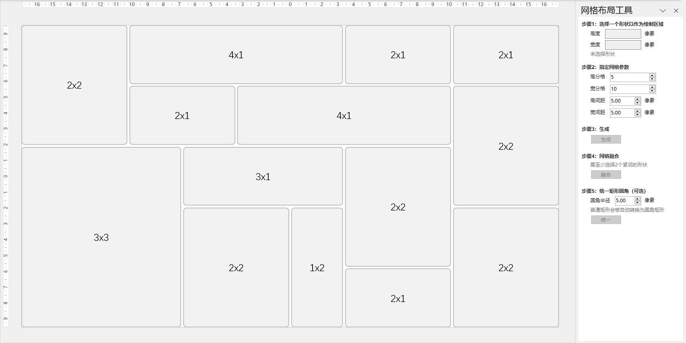
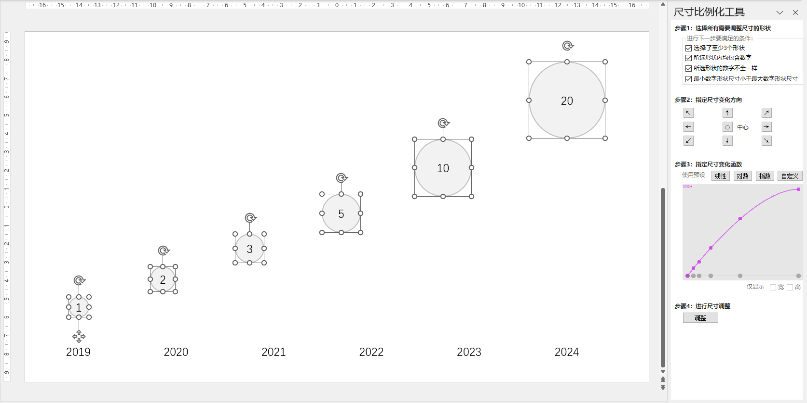

# RabbitTools (A PowerPoint Plugin)

**RabbitTools** aims to provide one-stoply solutions to several common tedious caveats while designing a beautiful slide.

## Functionalities

### Easy Grid Layout

The **Easy Grid Layout** is designed to facilitate the creation of grid layouts. It provides a structured and efficient way to organize shapes within a slide. Key functionalities include:

* **Selection of Layout Area:** Users can define a shape to act as the base area for the grid layout by specifying its height and width.

* **Grid Specifications:** The plugin allows users to define the number of rows and columns for the grid. Additional options include setting the height and width ratios of the cells and specifying the spacing (gaps) between the grid cells.

* **Grid Generation:** After setting the parameters, users can generate the grid layout by clicking the "Generate" button. The shapes will be automatically arranged based on the specified grid configuration.

* **Grid Merging:** Users can select two or more adjacent shapes and merge them into a single shape, providing flexibility in the layout design.

* **Uniform Rounded Corners (Optional):** The plugin includes an option to standardize the rounding of corners across all shapes in the grid, enhancing the aesthetic consistency of the layout. Users can specify the radius for the rounded corners.

This streamlines the process of creating organized and visually appealing grid layouts, making it easier for users to design structured slides.

### Easy Uniform Scale

The **Easy Uniform Scale** is designed to dynamically scale the sizes of shapes based on the numerical values they contain, facilitating the creation of visually impactful charts. It offers a step-by-step interface for users to select and adjust multiple shapes simultaneously. Key features include:

* **Shape Selection:** Users can select multiple shapes that contain numerical values.
* **Scaling Direction:** Options to specify how the shapes should resize, with buttons for adjusting scaling direction (up, down, left, right, or center).
* **Scaling Function:** Customizable scaling based on linear, logarithmic, or custom functions, allowing for precise control over how the shapes' sizes change relative to their numerical values.
* **Preview and Adjust:** A preview graph displays the scaling effect, enabling users to visualize changes before applying them.

This simplifies the process of creating proportionally accurate visual data representations, enhancing the clarity and impact of presentations.

## Roadmap

* Migrate this repo into the web plugin tech stack to enable cross-platform experience.
* I18n support.
* More functionalities support.
